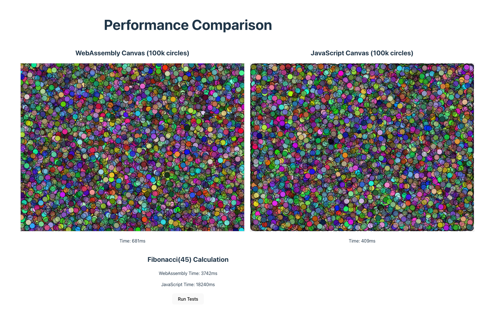
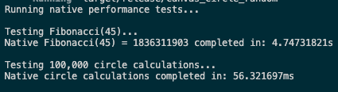

# WebAssembly vs JavaScript Performance Comparison

A small experiment comparing the performance of WebAssembly, JavaScript, and native Rust in two scenarios.

## Test Scenarios

### 1. Circle Drawing
Randomly generate 100,000 colored circles
- Native Rust: ~64ms
- WebAssembly: 678ms
- JavaScript: 425ms

#### Why is WebAssembly slower than JavaScript in drawing circles?
In this case, WebAssembly's performance is bottlenecked by frequent boundary crossings between WASM and JavaScript. For each circle, we need 5 API calls:
1. `begin_path()`
2. `arc()`
3. `set_fill_style()`
4. `fill()`
5. `stroke()`

This means 500,000 boundary crossings for 100,000 circles! Each crossing involves:
- Data serialization/deserialization
- Type conversion
- Context switching

Possible optimizations:
1. Batch processing: Collect all circle data in WASM and send them to JavaScript at once
2. Reduce boundary crossings: Complete all calculations in WASM and pass results in bulk
3. Use SharedArrayBuffer for memory sharing between WASM and JavaScript

### 2. Fibonacci Calculation 
Calculate Fibonacci(45)
- Native Rust: ~4.7s
- WebAssembly: 3.75s
- JavaScript: 18s

## Conclusions

1. For scenarios requiring frequent JS/Web API calls, plain JavaScript might perform better
2. For computation-intensive applications (like image processing or physics engines), WebAssembly offers significant performance improvements
3. While native implementation provides the best performance, WebAssembly is still considerably faster than JavaScript

---

# WebAssembly vs JavaScript 性能对比

小实验，对比了 WebAssembly、JavaScript 和原生 Rust 在两个场景下的性能表现。

## 实验场景

### 1. 画圈
随机生成 10 万个彩色小圆圈
- Native Rust: ~64ms
- WebAssembly: 678ms
- JavaScript: 425ms

#### 为什么在画圈场景中 WebAssembly 比 JavaScript 慢？
在这个场景中，WebAssembly 的性能瓶颈在于 WASM 和 JavaScript 之间频繁的边界调用。每画一个圆需要 5 次 API 调用：
1. `begin_path()`
2. `arc()`
3. `set_fill_style()`
4. `fill()`
5. `stroke()`

这意味着 10 万个圆就需要 50 万次边界调用。每次调用都涉及：
- 数据序列化/反序列化
- 类型转换
- 上下文切换

可能的优化方案：
1. 批处理：在 WASM 中收集所有圆的数据，一次性发送给 JavaScript
2. 减少边界调用：在 WASM 中完成所有计算，批量传递结果
3. 使用 SharedArrayBuffer 在 WASM 和 JavaScript 之间共享内存

### 2. 斐波那契数列计算 
计算 Fibonacci(45)
- Native Rust: ~4.7s
- WebAssembly: 3.75s
- JavaScript: 18s

## 总结

1. 在需要频繁调用 JS/Web API 的场景下，可能还不如直接用 JS
2. 如果你的应用涉及大量计算（比如图像处理、物理引擎之类的），WASM 确实能带来显著的性能提升
3. 想要最极致的性能还得用原生实现，但 WASM 也不赖，至少比 JS 强多了
